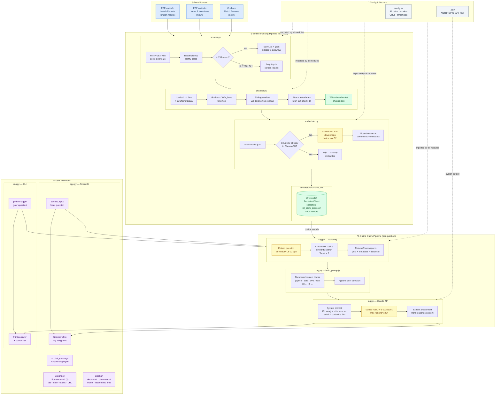

# IPL 2025 Press Conference RAG Bot

A local RAG (Retrieval-Augmented Generation) pipeline to answer natural-language questions about IPL 2025 player and captain interviews, match reports, and post-match reactions.

**Stack:** requests + BeautifulSoup → tiktoken → sentence-transformers + ChromaDB → Claude Haiku → Streamlit

---

## Architecture



---

## Setup

```bash
# 1. Clone / enter the folder
cd ipl-2025-pressconference-rag-bot

# 2. Create a virtual environment
python -m venv .venv && source .venv/bin/activate

# 3. Install dependencies
pip install -r requirements.txt

# 4. Add your Anthropic API key
cp .env.example .env
# edit .env and paste your key
```

---

## Run Order

| Step | Command | Time |
|------|---------|------|
| 1 | `python scraper.py` | 30–45 min |
| 2 | `python chunker.py` | ~10 sec |
| 3 | `python embedder.py` | 5–8 min |
| 4 | `streamlit run app.py` | instant |

Or test from the CLI:
```bash
python rag.py "What did Virat Kohli say after RCB won the IPL 2025 final?"
```

---

## Example Questions

1. What did Virat Kohli say after RCB won the IPL 2025 final?
2. How did captains react to the suspension in May?
3. Which coaches talked about the impact player rule?
4. What did Suryakumar Yadav say about MI's batting in 2025?
5. How did Punjab Kings captain react after losing the final?
6. Which captains mentioned pitch conditions most often?
7. What reasons did coaches give for losing close matches?
8. How did Dhoni describe CSK's bowling strategy in 2025?
9. What did RCB players say about their maiden IPL title?
10. How did teams respond to the India-Pakistan tensions pause?

---

## Folder Structure

```
ipl-2025-pressconference-rag-bot/
├── config.py          # Central configuration
├── scraper.py         # Web scraper (3 sources)
├── chunker.py         # Token-based chunker (tiktoken)
├── embedder.py        # sentence-transformers + ChromaDB
├── rag.py             # Retriever + Claude query engine
├── app.py             # Streamlit chat UI
├── requirements.txt
├── .env.example
├── .gitignore
├── data/
│   ├── raw/           # .txt + .json sidecar pairs
│   ├── chunks/        # chunks.json
│   └── scrape_log.txt
└── vectorstore/
    └── chroma_db/
```

---

## Potential Issues & Fixes

| Step | Risk | Fix |
|------|------|-----|
| Scraper | ESPNcricinfo returns 403 | They block bots — if blocked, try again after a few minutes; the scraper logs and skips gracefully |
| Scraper | Pages are JS-rendered, content sparse | This is expected with requests-only scraping; Cricbuzz and news pages tend to have better static HTML |
| Scraper | < 60 docs collected | Lower `MIN_DOC_WORDS` in config.py from 150 → 100 |
| Embedder | `MPS` device warning | Already forced to `device="cpu"` in embedder.py — safe to ignore |
| Embedder | `chromadb` version conflict | Pin to `chromadb==0.5.23` as in requirements.txt |
| RAG | `ANTHROPIC_API_KEY not set` | Copy `.env.example` → `.env` and fill in your key |
| Streamlit | "Collection not found" | Run embedder.py before app.py |
| General | `tiktoken` download on first run | It downloads ~1 MB encoding tables — one-time, needs internet |
