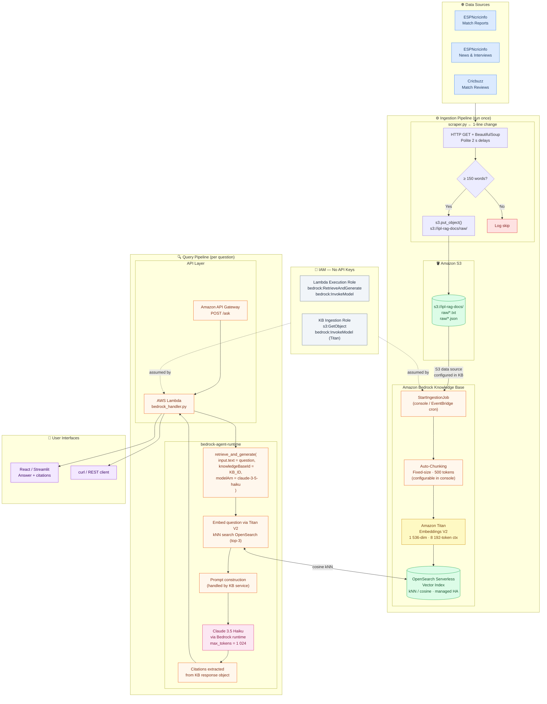
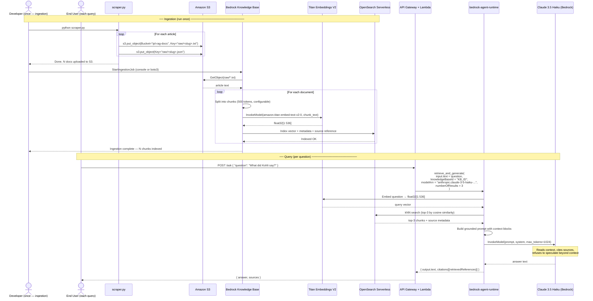
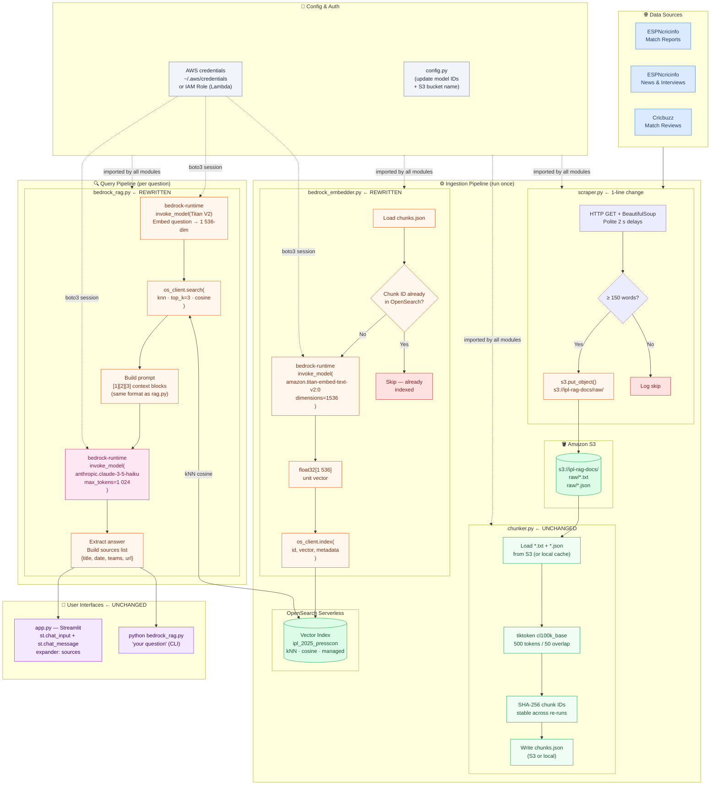
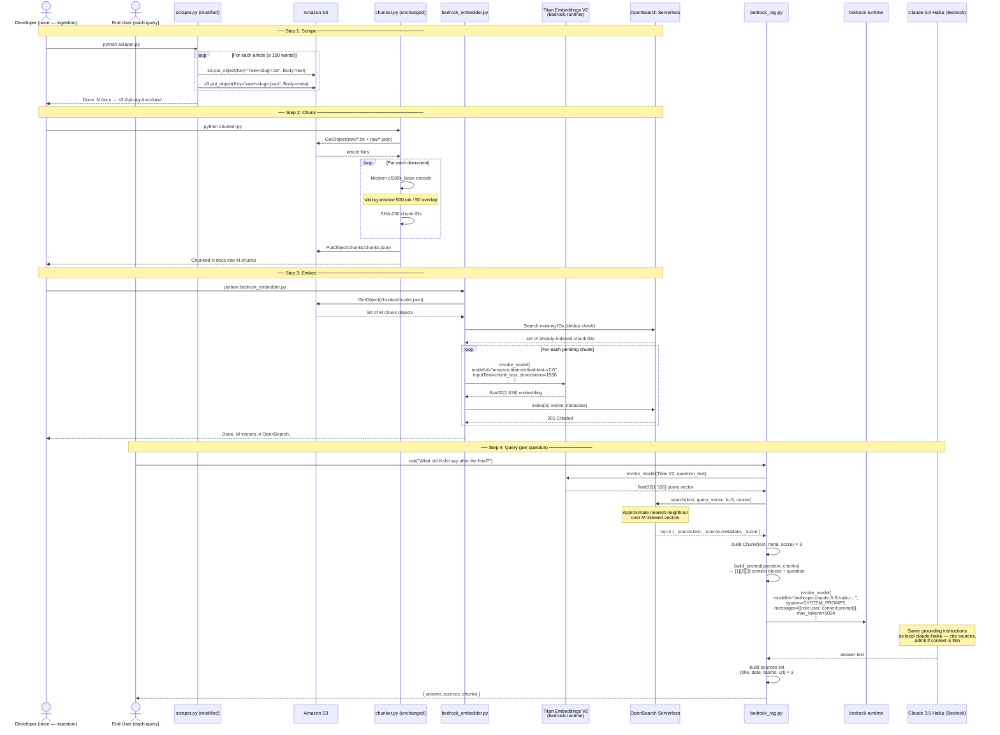

# AWS Bedrock Alternative Architecture

## Overview

This document describes how the IPL 2025 Press Conference RAG Bot could be rebuilt on **AWS Bedrock** — Amazon's fully managed foundation model service. Two approaches are presented, ranging from fully managed (minimal code) to DIY (preserves the existing pipeline structure).

The local baseline uses:
- `sentence-transformers` (`all-MiniLM-L6-v2`, 384-dim) for embeddings
- ChromaDB (local persistent) as the vector store
- `anthropic` SDK → `claude-haiku-4-5-20251001` for generation

Both Bedrock approaches replace these three components with AWS equivalents while keeping `scraper.py` and `chunker.py` largely intact.

---

## Approach A — Fully Managed (Bedrock Knowledge Bases)

AWS Bedrock Knowledge Bases replace `chunker.py`, `embedder.py`, and ChromaDB entirely. The entire indexing pipeline collapses into a single **Sync Job** triggered from the AWS console or API. At query time, a single `retrieve_and_generate()` call handles retrieval, prompt construction, and generation.

### How It Works

| Stage | Who Does It | Detail |
|-------|------------|--------|
| Scraping | `scraper.py` (one line changed) | Output goes to S3 instead of local disk |
| Chunking | Bedrock KB (automatic) | Fixed-size, configurable token count |
| Embedding | Amazon Titan Embeddings V2 | 1 536-dim, 8 192-token context |
| Vector Store | OpenSearch Serverless | Managed kNN index, HA, zero ops |
| Retrieval + Generation | `bedrock-agent-runtime` | Single `retrieve_and_generate()` call |
| Auth | IAM Roles | No API keys; Lambda assumes execution role |

### Component Diagram



### Sequence Diagram



---

## Approach B — DIY on Bedrock (Custom Pipeline)

This approach keeps the full pipeline structure of the local implementation. Only the AI components are swapped — `sentence-transformers` becomes **Bedrock Titan Embeddings**, ChromaDB becomes **OpenSearch Serverless**, and the `anthropic` SDK becomes **`boto3` + `bedrock-runtime`**. The pipeline scripts remain individually runnable in the same order.

### How It Works

| Stage | Current | Bedrock Equivalent | Change |
|-------|---------|-------------------|--------|
| Scraping | `scraper.py` → `data/raw/` | `scraper.py` → S3 | 1 line (`open()` → `s3.put_object()`) |
| Chunking | `chunker.py` + tiktoken | `chunker.py` (unchanged) | None |
| Embedding | `embedder.py` + MiniLM | `bedrock_embedder.py` + Titan V2 | Full rewrite |
| Vector store | ChromaDB local | OpenSearch Serverless | Full rewrite |
| Retrieval + LLM | `rag.py` + `anthropic` SDK | `bedrock_rag.py` + `boto3` | Full rewrite |
| Auth | `ANTHROPIC_API_KEY` in `.env` | IAM Role / AWS credentials | Config change |
| UI | `app.py` Streamlit | `app.py` Streamlit (unchanged) | None |

### Component Diagram



### Sequence Diagram



---

## Component Comparison

| Component | Local (Baseline) | Approach A — Managed | Approach B — DIY |
|-----------|-----------------|---------------------|-----------------|
| **Scraper** | `data/raw/*.txt` | S3 (`s3.put_object`) | S3 (`s3.put_object`) |
| **Chunking** | `chunker.py` + tiktoken | Bedrock KB (automatic) | `chunker.py` (unchanged) |
| **Embedding model** | `all-MiniLM-L6-v2` · 384-dim | Titan Embeddings V2 · 1 536-dim | Titan Embeddings V2 · 1 536-dim |
| **Embedding infra** | `embedder.py` (local process) | Bedrock KB sync job | `bedrock_embedder.py` + boto3 |
| **Vector store** | ChromaDB (local SQLite + HNSW) | OpenSearch Serverless (managed) | OpenSearch Serverless (managed) |
| **Retrieval** | `collection.query()` ChromaDB | Auto inside `retrieve_and_generate()` | `os_client.search(knn)` |
| **LLM SDK** | `anthropic` Python SDK | `bedrock-agent-runtime` boto3 | `bedrock-runtime` boto3 |
| **LLM model ID** | `claude-haiku-4-5-20251001` | `anthropic.claude-3-5-haiku-...-v1:0` | `anthropic.claude-3-5-haiku-...-v1:0` |
| **Auth** | `ANTHROPIC_API_KEY` in `.env` | IAM Role (no secrets) | IAM Role / `~/.aws/credentials` |
| **UI** | Streamlit `app.py` | React + Amplify (or keep Streamlit) | Streamlit `app.py` (unchanged) |
| **Files changed** | — | `scraper.py` (1 line) | `scraper.py`, `bedrock_embedder.py`, `bedrock_rag.py` |
| **Files removed** | — | `chunker.py`, `embedder.py` | `embedder.py`, `rag.py` (replaced) |

---

## Code Change Summary

### `scraper.py` — both approaches (1-line change)

```python
# BEFORE: write to local disk
with open(f"data/raw/{slug}.txt", "w") as f:
    f.write(content)

# AFTER: upload to S3
import boto3
s3 = boto3.client("s3", region_name="us-east-1")
s3.put_object(Bucket="ipl-rag-docs", Key=f"raw/{slug}.txt",
              Body=content.encode())
s3.put_object(Bucket="ipl-rag-docs", Key=f"raw/{slug}.json",
              Body=json.dumps(metadata).encode())
```

### `bedrock_embedder.py` — Approach B only (Approach A eliminates this file)

```python
import boto3, json

bedrock = boto3.client("bedrock-runtime", region_name="us-east-1")

def embed(text: str) -> list[float]:
    response = bedrock.invoke_model(
        modelId="amazon.titan-embed-text-v2:0",
        body=json.dumps({"inputText": text, "dimensions": 1536}),
    )
    return json.loads(response["body"].read())["embedding"]
```

### `bedrock_rag.py` — Approach B LLM call

```python
import boto3, json

bedrock = boto3.client("bedrock-runtime", region_name="us-east-1")

def generate(prompt: str, system: str) -> str:
    response = bedrock.invoke_model(
        modelId="anthropic.claude-3-5-haiku-20241022-v1:0",
        body=json.dumps({
            "anthropic_version": "bedrock-2023-05-31",
            "max_tokens": 1024,
            "system": system,
            "messages": [{"role": "user", "content": prompt}],
        }),
    )
    return json.loads(response["body"].read())["content"][0]["text"]
```

### `bedrock_handler.py` — Approach A single call

```python
import boto3

agent_rt = boto3.client("bedrock-agent-runtime", region_name="us-east-1")

def ask(question: str) -> dict:
    response = agent_rt.retrieve_and_generate(
        input={"text": question},
        retrieveAndGenerateConfiguration={
            "type": "KNOWLEDGE_BASE",
            "knowledgeBaseConfiguration": {
                "knowledgeBaseId": "YOUR_KB_ID",
                "modelArn": (
                    "arn:aws:bedrock:us-east-1::foundation-model/"
                    "anthropic.claude-3-5-haiku-20241022-v1:0"
                ),
                "retrievalConfiguration": {
                    "vectorSearchConfiguration": {"numberOfResults": 3}
                },
            },
        },
    )
    return {
        "answer": response["output"]["text"],
        "sources": response.get("citations", []),
    }
```

### `requirements.txt` — dependencies change

```diff
- anthropic==0.40.0
- chromadb==0.5.23
- sentence-transformers==3.3.1
+ boto3>=1.34.0
+ opensearch-py>=2.4.0        # Approach B only
  tiktoken==0.8.0              # Approach B only (A removes chunker.py)
  streamlit==1.40.2            # Keep if retaining Streamlit UI
  beautifulsoup4==4.12.3       # scraper.py — unchanged
  requests==2.32.3             # scraper.py — unchanged
  python-dotenv==1.0.1         # Now loads AWS_REGION, S3_BUCKET, etc.
```

---

## Key Design Decisions & Trade-offs

| Area | Improvement on Bedrock | Trade-off |
|------|----------------------|-----------|
| **Embedding quality** | 384-dim → 1 536-dim; Titan V2 is multilingual and trained on a broader corpus | API latency per chunk vs local CPU; cost per 1 K tokens |
| **Vector store** | OpenSearch Serverless is fully managed, HA, auto-scaled — zero ops | No local fallback; needs real AWS account even in dev |
| **Security** | IAM roles, no secrets in `.env`; auditable via CloudTrail | Needs IAM setup; local dev requires `~/.aws/credentials` or a dev role |
| **Scalability** | Serverless: handles concurrent users, no OOM risk | Lambda cold starts add ~200–800 ms on first query |
| **Observability** | CloudWatch logs, Bedrock model invocation logs, X-Ray tracing | More setup than `print()` statements |
| **Pipeline control** | Approach A: zero chunking code to maintain | Approach A: chunking parameters are console-only; no programmatic custom logic |
| **Cost model** | Bedrock on-demand pricing (pay per call) | At low query volume, direct Anthropic API + local ChromaDB is cheaper; Bedrock becomes cost-effective at scale |
| **Portability** | Deep AWS coupling | Switching providers later requires a rewrite of embedding + retrieval + generation layers |

### Recommended Contribution Path

If contributing a Bedrock backend to this repo:

1. Start with **Approach B** — easier to reason about, all stages are visible and debuggable
2. Add `bedrock_embedder.py` and `bedrock_rag.py` **alongside** the existing files — don't delete anything
3. Add a `RAG_BACKEND=local|bedrock` env-var switch in `config.py` so users without AWS credentials can still run the original pipeline
4. Validate that the same questions produce equivalent answers before retiring the local path
5. Layer Approach A on top once Approach B is validated — Approach A is strictly less code but harder to debug when citations are wrong
