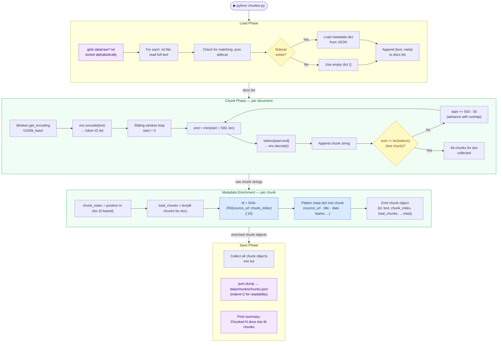
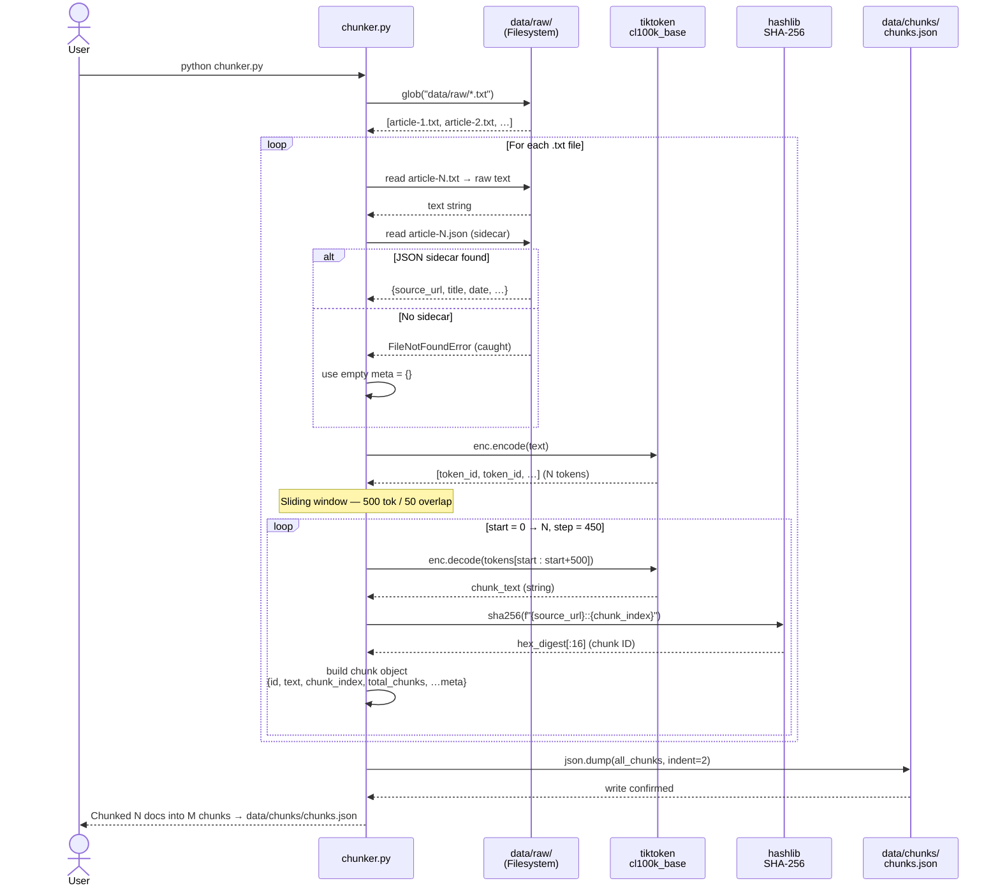

# Chunker

## Overview

`chunker.py` is the **text preparation layer**. It takes the raw article files produced by the scraper and splits them into overlapping token windows that are small enough for a vector embedding model to process accurately and large enough to carry meaningful context.

The output — `data/chunks/chunks.json` — is the single input consumed by the embedder. Every chunk carries the full metadata of its parent document, so the RAG engine can surface precise source citations without any secondary lookup.

---

## Tech Stack

| Library | Version | Role | Why this choice |
|---------|---------|------|-----------------|
| `tiktoken` | 0.8 | Tokeniser | OpenAI's BPE tokeniser; `cl100k_base` encoding is used by GPT-4, Claude, and `all-MiniLM-L6-v2`'s training data — token counts are accurate rather than approximated by word count |
| `json` | stdlib | I/O | Universal format; chunks.json is human-inspectable and can be consumed by any downstream tool |
| `hashlib` | stdlib | Chunk ID generation | SHA-256 of `source_url::chunk_index` produces collision-resistant IDs that are stable across re-runs — the embedder uses these to skip already-processed chunks |
| `glob` | stdlib | File discovery | Matches `data/raw/*.txt` without shell expansion — safe on all platforms |

**Why `cl100k_base` encoding?**
Tiktoken's `cl100k_base` is the byte-pair encoding (BPE) vocabulary used by `text-embedding-ada-002`, GPT-4, and most modern LLMs. Using it here means our chunk boundaries align with how the embedding model (`all-MiniLM-L6-v2`) was trained, reducing the chance of a meaningful phrase being split across a chunk boundary mid-subword.

**Why 500 tokens / 50-token overlap?**

| Parameter | Value | Reasoning |
|-----------|-------|-----------|
| `CHUNK_SIZE` | 500 tokens | Fits comfortably within MiniLM's 256-token limit after truncation, while carrying ~350 words of context — enough for a full quote + surrounding paragraph |
| `CHUNK_OVERLAP` | 50 tokens | ~10% overlap. Prevents a sentence that straddles a boundary from being semantically orphaned in both halves |

> **Note:** `all-MiniLM-L6-v2` hard-truncates input at 256 tokens. With 500-token chunks the model sees the first 256 tokens only. This is intentional — longer chunks are still useful because they give more context to the reader in the source expander, and the most salient content (names, quotes, match scores) typically appears early in a paragraph.

---

## Component Diagram



---

## Sequence Diagram



---

## Chunk Object Schema

```json
{
  "id":           "a3f8c1d2e4b56789",
  "text":         "Virat Kohli said after the final: 'This is for every RCB fan …'",
  "chunk_index":  2,
  "total_chunks": 5,
  "source_url":   "https://www.espncricinfo.com/series/.../match-report",
  "title":        "RCB beat PBKS by 6 runs — Match Report",
  "date":         "2025-06-03",
  "teams":        [],
  "match_number": "",
  "author":       "",
  "source":       "espncricinfo_match_report",
  "file_path":    "data/raw/rcb-beat-pbks-by-6-runs.txt"
}
```

---

## Key Design Decisions

| Decision | Rationale |
|----------|-----------|
| SHA-256 chunk ID from `source_url::index` | Deterministic and stable — the same article always produces the same IDs across re-runs, enabling the embedder's skip logic |
| Flatten metadata into every chunk | Avoids a join at query time; the RAG engine gets full citation info from the vector store result alone |
| Overlap of 10% (50/500) | Empirically balanced — enough to catch cross-boundary sentences without doubling corpus size |
| Sort `.txt` files alphabetically | Deterministic processing order for reproducible `chunk_index` values |
| `cl100k_base` vs word-split | Word count varies wildly by language and punctuation; token count is a stable unit that directly maps to model context limits |
