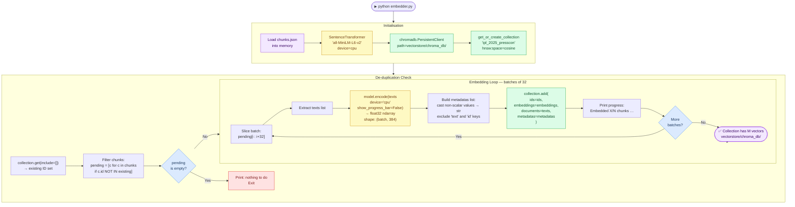
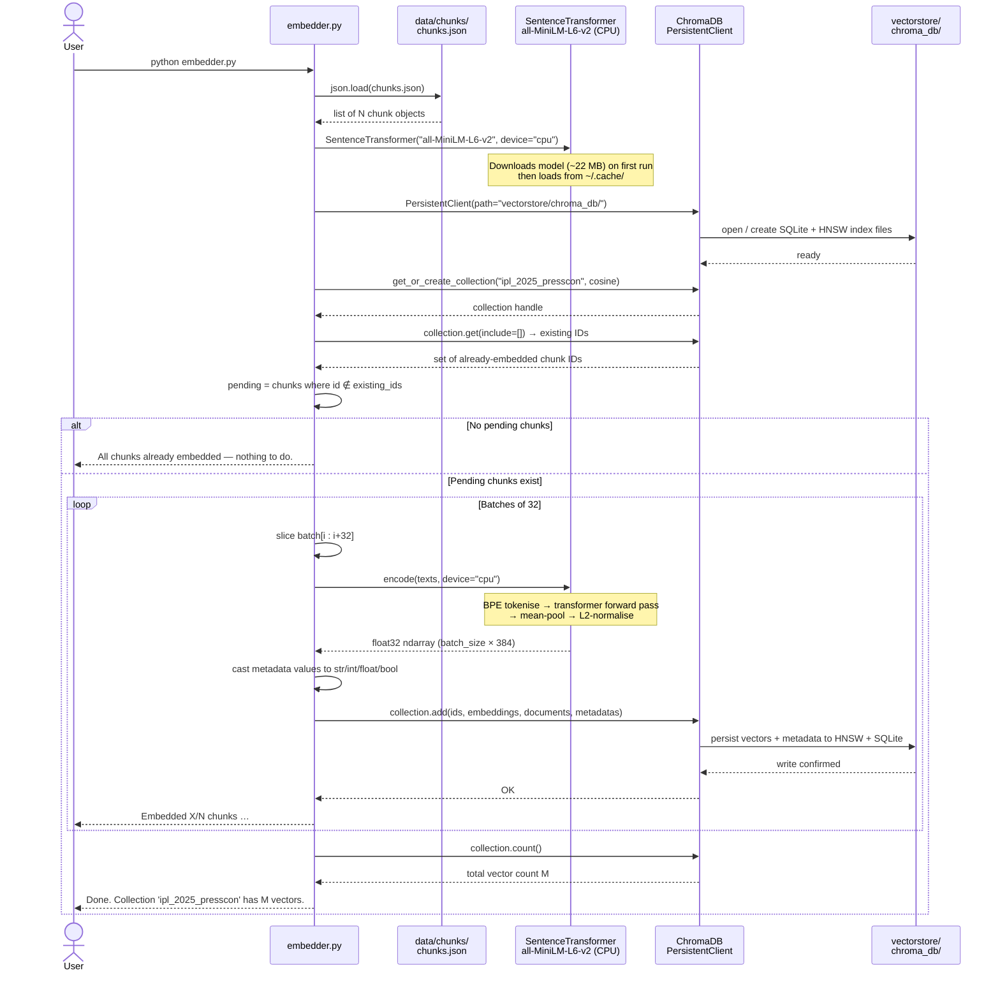

# Embedder

## Overview

`embedder.py` is the **vector indexing layer**. It takes every chunk from `chunks.json`, converts it into a dense floating-point vector using a local embedding model, and stores the vectors — alongside the original text and metadata — in a persistent ChromaDB collection on disk.

This step runs once (or incrementally when new chunks are added). The resulting vector store is what makes semantic search possible: instead of matching keywords, the RAG engine can find chunks that are *conceptually similar* to a question even when they share no words with it.

---

## Tech Stack

| Library | Version | Role | Why this choice |
|---------|---------|------|-----------------|
| `sentence-transformers` | 3.3 | Embedding model wrapper | De-facto standard for local semantic embeddings; supports 100+ HuggingFace models with a one-line API |
| `all-MiniLM-L6-v2` | — | Embedding model | 22 MB, 256-token context, 384-dim vectors; fastest CPU-runnable model with strong semantic similarity benchmarks (MTEB top-10 at its size class) |
| `chromadb` | 0.5.23 | Vector store | Fully local, zero-config, persistent storage; cosine similarity search built-in; no cloud account needed |
| `json` | stdlib | Chunk loading | Reads the flat list produced by chunker.py |

**Why `all-MiniLM-L6-v2` over larger models?**

| Model | Dim | Size | Speed (M2 CPU) | Quality |
|-------|-----|------|----------------|---------|
| `all-MiniLM-L6-v2` | 384 | 22 MB | ~1 000 chunks/min | Good |
| `all-mpnet-base-v2` | 768 | 438 MB | ~200 chunks/min | Better |
| `text-embedding-3-small` (OpenAI API) | 1 536 | — | API latency | Excellent |
| `amazon.titan-embed-text-v2:0` (AWS Bedrock) | 1 536 | — | API latency | Excellent |

For a hobby project on M2 Air with 8 GB RAM, MiniLM hits the right tradeoff: fast enough to embed ~400 chunks in under 8 minutes, good enough for cricket quote retrieval where sentences are relatively short and domain-specific.

> **AWS Bedrock alternative:** Titan Embeddings V2 produces 1 536-dim vectors with an 8 192-token context window (vs MiniLM's 256-token hard truncation), which means long chunks are fully encoded rather than silently truncated. See [`docs/bedrock.md`](bedrock.md) for the full migration path.

**Why ChromaDB over FAISS / Pinecone / OpenSearch?**

| | ChromaDB | FAISS | Pinecone | OpenSearch Serverless |
|--|---------|-------|---------|----------------------|
| Setup | `pip install` | `pip install` + compile | Cloud account | IAM + boto3 |
| Persistence | Auto (SQLite + files) | Manual save/load | Cloud | Cloud (managed) |
| Metadata filtering | Built-in | Not built-in | Built-in | Built-in |
| Re-run safety | ID-based upsert | Manual dedup | ID-based | ID-based upsert |
| Local-only | ✅ | ✅ | ❌ | ❌ |
| Managed / HA | ❌ | ❌ | ✅ | ✅ |

OpenSearch Serverless is the vector store used in the AWS Bedrock alternative — see [`docs/bedrock.md`](bedrock.md).

**Why `device="cpu"` explicitly?**
macOS MPS (Metal Performance Shaders) backend in PyTorch has known compatibility issues with `sentence-transformers` on some macOS + Python version combinations. Forcing CPU avoids silent correctness bugs in vector outputs.

---

## Component Diagram



---

## Sequence Diagram



---

## What the Embedding Model Actually Does

```
Input text (string)
       │
       ▼
  BPE Tokeniser  ──►  token IDs  (max 256 tokens, truncated if longer)
       │
       ▼
  6-layer Transformer (MiniLM architecture)
  • 384 hidden dimensions
  • 12 attention heads
  • ~22 M parameters
       │
       ▼
  Mean pooling over token embeddings
       │
       ▼
  L2 normalisation  ──►  unit vector in ℝ³⁸⁴
       │
       ▼
  Output: float32[384]  stored in ChromaDB
```

Cosine similarity between two such vectors equals their dot product (because they're unit vectors). ChromaDB's HNSW index exploits this to answer approximate nearest-neighbour queries in O(log N) time rather than brute-force O(N).

---

## Key Design Decisions

| Decision | Rationale |
|----------|-----------|
| Batch size 32 | Saturates CPU L2/L3 cache for matrix ops without exceeding 8 GB RAM even for large corpora |
| `hnsw:space=cosine` | Semantic similarity is direction-based (angle between vectors), not magnitude-based; cosine handles this correctly. Euclidean distance would penalise short chunks |
| Cast metadata to scalar types | ChromaDB rejects Python lists/dicts inside metadata; lists (e.g. `teams`) are cast to `str` to preserve them without losing data |
| Re-run safety via ID check | Running `embedder.py` again after adding new scraped docs only embeds the new chunks; existing vectors are untouched |
| `device="cpu"` | MPS backend has known bugs with sentence-transformers on macOS; CPU is slower but produces correct, reproducible embeddings |
