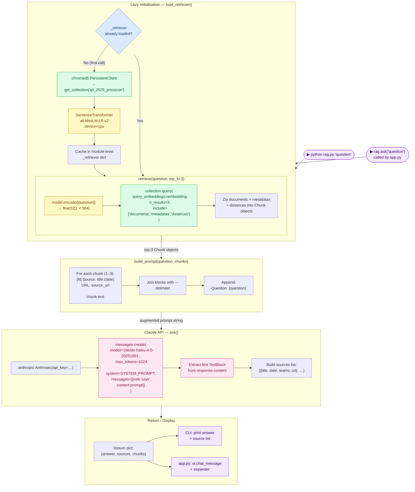
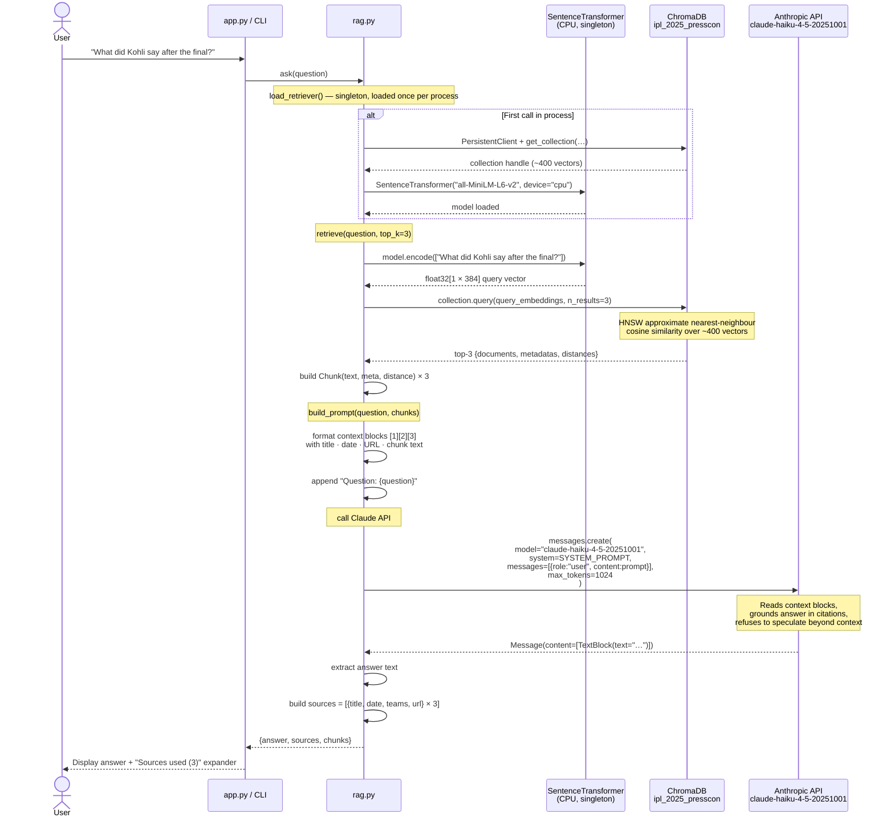

# RAG Query Engine

## Overview

`rag.py` is the **intelligence layer** — the component that transforms a natural-language question into a grounded, cited answer. It combines three sub-steps:

1. **Retrieve** — embed the question and find the most semantically similar chunks in ChromaDB
2. **Augment** — inject the retrieved chunks as numbered context into a structured prompt
3. **Generate** — send the prompt to Claude Haiku and return the answer with source metadata

The module exposes both a Python API (`ask(question) → dict`) for the Streamlit UI and a CLI entrypoint (`python rag.py "your question"`).

---

## Tech Stack

| Library | Version | Role | Why this choice |
|---------|---------|------|-----------------|
| `anthropic` | 0.40 | Claude API SDK | Official Python SDK; handles auth, retries, and response parsing |
| `claude-haiku-4-5-20251001` | — | LLM for generation | Fastest Claude model; ideal for Q&A where latency matters and answers are short. At $1/1M input tokens it's also the most cost-effective option for a hobby project |
| `sentence-transformers` | 3.3 | Query embedding | Same model used at index time (`all-MiniLM-L6-v2`) — query and document vectors live in the same embedding space |
| `chromadb` | 0.5.23 | Vector retrieval | Cosine similarity search over the pre-built HNSW index |
| `python-dotenv` | 1.0 | API key loading | Reads `ANTHROPIC_API_KEY` from `.env` without exposing it in code |

**Why Claude Haiku over GPT-3.5 / local LLMs?**

| | Claude Haiku (direct) | Claude Haiku (Bedrock) | GPT-3.5-turbo | Llama-3-8B (local) |
|--|----------------------|----------------------|--------------|-------------------|
| Latency | ~1 s | ~1–2 s | ~1 s | 20–60 s on M2 Air |
| Quality (Q&A) | High | High (same model) | High | Medium |
| Cost | $1/1M in | Bedrock on-demand | $0.50/1M in | Free |
| Instruction following | Excellent | Excellent | Good | Variable |
| RAM needed | API only | API only | API only | 8 GB+ |
| Auth | `ANTHROPIC_API_KEY` | IAM Role | `OPENAI_API_KEY` | Local weights |

Local LLMs are ruled out by the 8 GB RAM constraint on M2 Air — loading an 8B model leaves no headroom for the rest of the pipeline. Between the API options, Haiku's instruction-following quality and explicit citation behaviour are noticeably stronger for this use case.

> **AWS Bedrock note:** Claude Haiku is also available via AWS Bedrock (`anthropic.claude-3-5-haiku-20241022-v1:0`). The model quality is identical — the difference is auth (IAM instead of an API key) and SDK (`boto3` + `bedrock-runtime` instead of the `anthropic` package). See [`docs/bedrock.md`](bedrock.md) for the full approach.

**Why Top-K = 3?**
Three chunks fit comfortably within Haiku's context window while keeping prompt cost low. Empirically, the third chunk rarely adds new information for a narrow factual question; raising to 5 increases cost by ~40% with marginal quality gain.

---

## Component Diagram



---

## Sequence Diagram



---

## System Prompt

```
You are an expert IPL cricket analyst with access to IPL 2025 press conference
transcripts, match reports, and player interviews. Answer questions using only
the provided context. If the context does not contain enough information, say so
clearly. Always cite which match or interview your answer comes from.
```

**Why this phrasing?**

| Instruction | Purpose |
|-------------|---------|
| "using only the provided context" | Prevents Claude from hallucinating facts from its training data about IPL 2025 |
| "If the context does not contain enough information, say so clearly" | Produces an honest "I don't know" rather than a confident wrong answer |
| "Always cite which match or interview" | Forces grounded responses; matches the source expander in the UI |

---

## Prompt Structure (Example)

```
Context:

[1] Source: RCB beat PBKS by 6 runs — Match Report (2025-06-03)
URL: https://www.espncricinfo.com/series/.../match-report

Virat Kohli was visibly emotional at the post-match presentation.
"This is for every RCB fan who waited 17 years," he said …

---

[2] Source: Kohli speaks after historic win (2025-06-04)
URL: https://www.espncricinfo.com/story/…

In a press conference the following morning, Kohli elaborated …

---

[3] Source: Faf du Plessis on RCB's journey (2025-06-03)
URL: https://www.cricbuzz.com/cricket-news/…

Captain Faf du Plessis credited the team's batting depth …

Question: What did Virat Kohli say after RCB won the IPL 2025 final?
```

---

## Return Object Schema

```python
{
    "answer": "Virat Kohli said 'This is for every RCB fan who waited 17 years' …",
    "sources": [
        {
            "title": "RCB beat PBKS by 6 runs — Match Report",
            "date":  "2025-06-03",
            "teams": "[]",
            "url":   "https://www.espncricinfo.com/series/…/match-report"
        },
        { … },
        { … }
    ],
    "chunks": [Chunk(text=…, meta={…}, distance=0.18), …]   # internal; not shown in UI
}
```

---

## Key Design Decisions

| Decision | Rationale |
|----------|-----------|
| Singleton `_retriever` dict | Loading the embedding model and opening the ChromaDB client both take ~2 s. Caching them at module level means the Streamlit app only pays this cost on the first question per session |
| Same embedding model for index and query | Query and document vectors must live in the same vector space. Using different models would produce meaningless similarity scores |
| `max_tokens=1024` | Q&A answers about cricket quotes are short. 1 024 tokens (~750 words) is plenty; a lower limit risks truncation mid-sentence |
| Return raw `chunks` in response dict | The Streamlit app only needs `sources` for display, but returning `chunks` (with `distance` scores) lets a developer inspect retrieval quality without re-running the pipeline |
| `top_k=3` default (configurable in config.py) | Three chunks = ~1 500 tokens of context, well within Haiku's 200 K window but minimal enough to keep prompt cost low |
