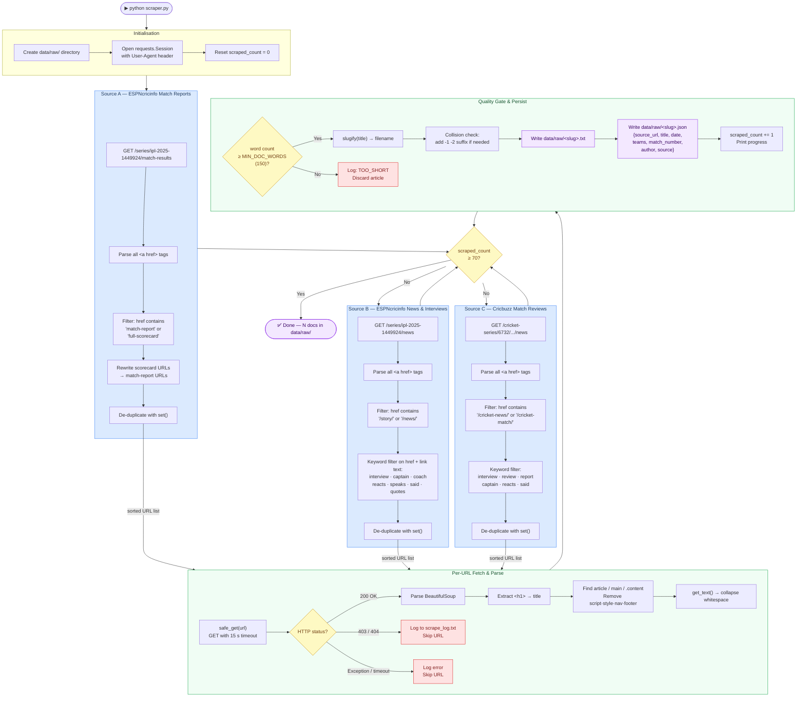
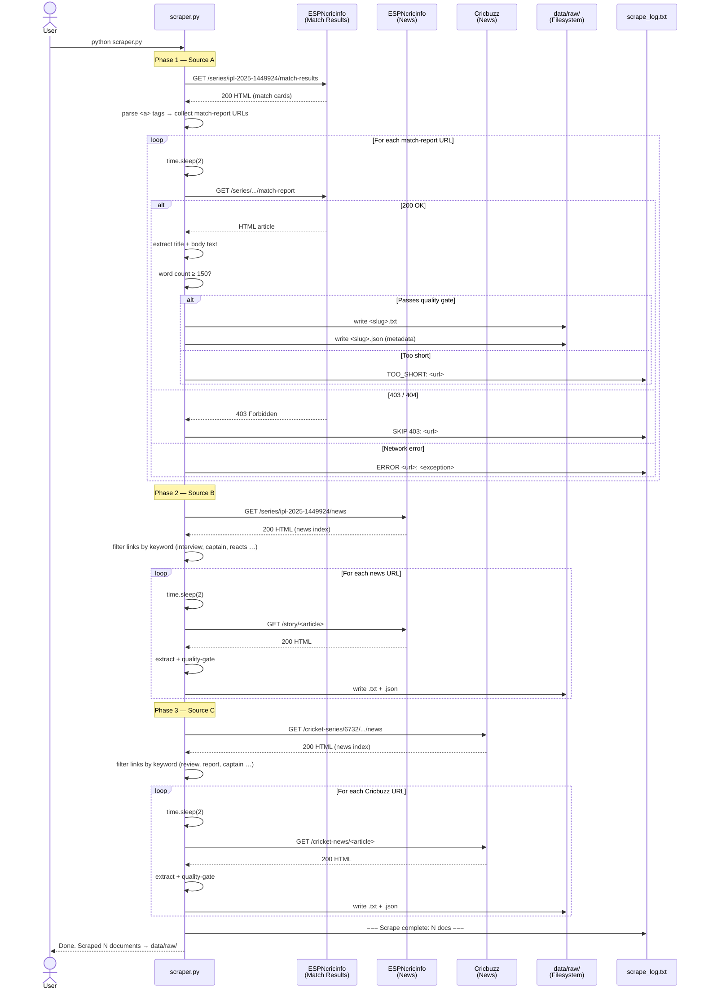

# Scraper Service

## Overview

`scraper.py` is the **data collection layer** of the pipeline. It harvests written text about IPL 2025 from three cricket journalism sources, applies quality filters, and persists each article as a plain-text file alongside a structured JSON metadata sidecar. Every downstream component — chunker, embedder, RAG engine — depends on the output of this step.

The scraper is intentionally simple: no headless browser, no JavaScript execution, no proxy rotation. It targets the static HTML that servers return to a plain `GET` request, which is sufficient for article bodies on these sites.

---

## Tech Stack

| Library | Version | Role | Why this choice |
|---------|---------|------|-----------------|
| `requests` | 2.32 | HTTP client | Industry-standard, connection pooling via `Session`, clean timeout control |
| `BeautifulSoup4` | 4.12 | HTML parser | Tolerant of malformed HTML (common on sports sites); simple CSS/tag selector API |
| `lxml` (bs4 backend) | — | Fast HTML parser | 3–5× faster than Python's built-in `html.parser` for large pages |
| `time.sleep` | stdlib | Rate limiting | Polite crawling — 2 s gap prevents IP bans and respects server load |
| `json` | stdlib | Metadata serialisation | Human-readable sidecar files that any downstream tool can consume |
| `re` | stdlib | URL filtering & slugs | Lightweight pattern matching without adding a dependency |

**Why `requests` over `httpx` or `aiohttp`?**
Scraping here is I/O-bound but sequential (intentional rate limiting). `requests` is synchronous, battle-tested, and has zero async complexity overhead. Async would only help if we parallelised requests — which we deliberately avoid to stay polite.

**Why not Selenium / Playwright?**
ESPNcricinfo's article bodies render some content server-side in static HTML. A headless browser adds ~500 MB of Chromium, significant startup latency, and anti-bot fingerprinting risk. For this hobby project the tradeoff is not worth it.

---

## Component Diagram



---

## Sequence Diagram



---

## Key Design Decisions

| Decision | Rationale |
|----------|-----------|
| `requests.Session` (not bare `requests.get`) | Reuses TCP connections; shares headers across all requests automatically |
| 2-second `time.sleep` between every request | Mimics human browsing pace; reduces chance of IP rate-limiting by target sites |
| Keyword filter on URL + anchor text | Eliminates scorecard-only and stats pages; focuses the corpus on spoken-word content |
| `.txt` + `.json` sidecar pattern | Keeps raw text and metadata decoupled; either file can be inspected or replaced independently without touching the other |
| SHA-256 collision-safe slug suffix | Prevents overwriting when two articles have the same title slug |
| Hard stop at 70 documents | Keeps embedding time under 8 min on M2 Air; prevents runaway scraping on a first run |

---

## Output Schema (`data/raw/<slug>.json`)

```json
{
  "source_url":   "https://www.espncricinfo.com/series/.../match-report",
  "title":        "RCB beat PBKS by 6 runs — Match Report",
  "date":         "2025-06-03",
  "teams":        [],
  "match_number": "",
  "author":       "",
  "source":       "espncricinfo_match_report"
}
```

> `teams`, `match_number`, and `author` are scaffolded for future enrichment (e.g. regex extraction from the article body or ESPNcricinfo's JSON API).
